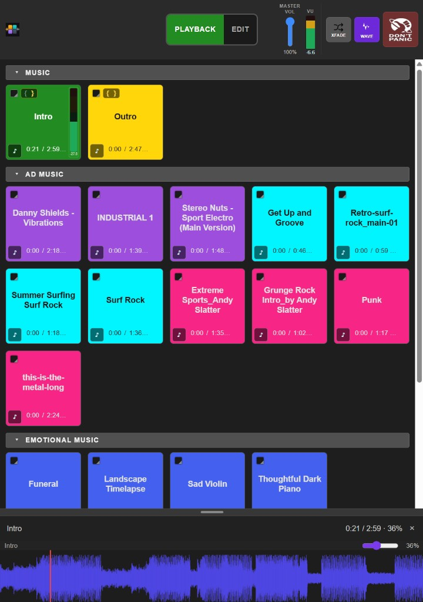
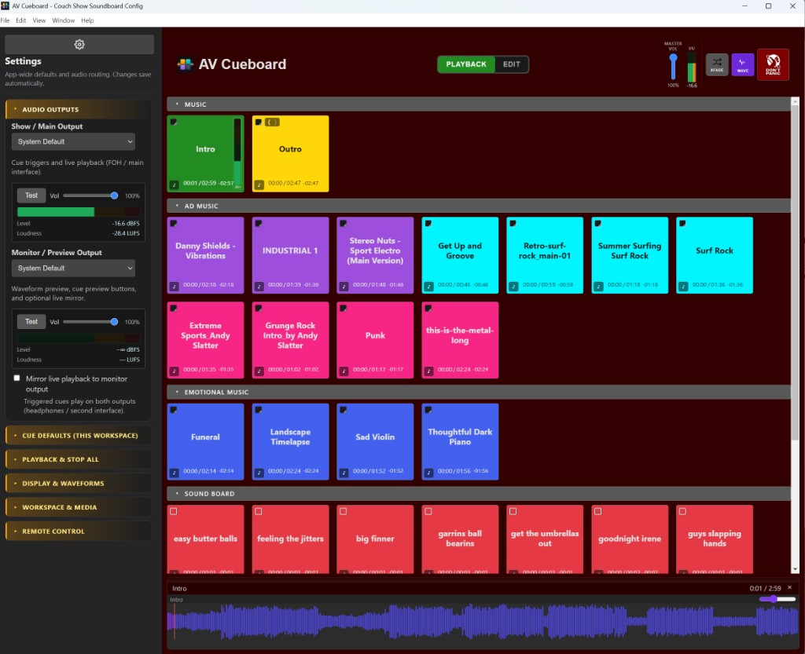
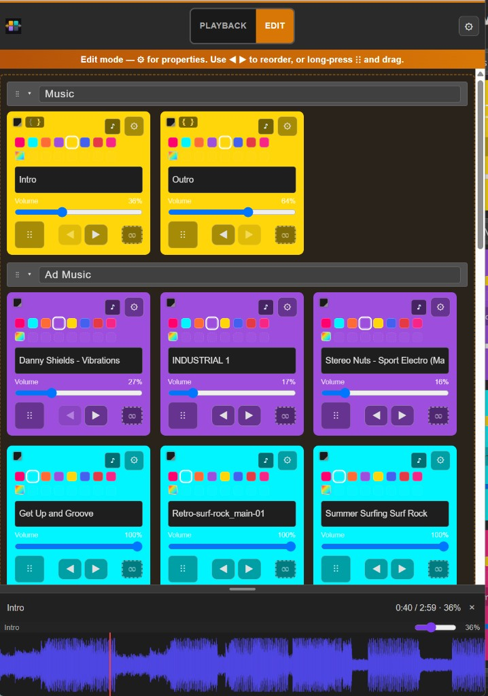
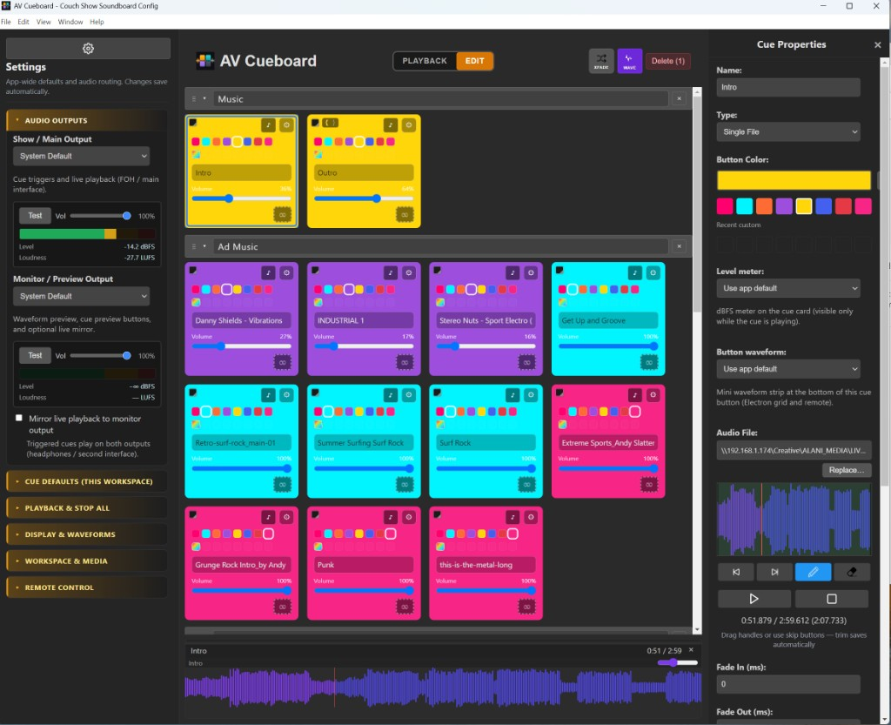
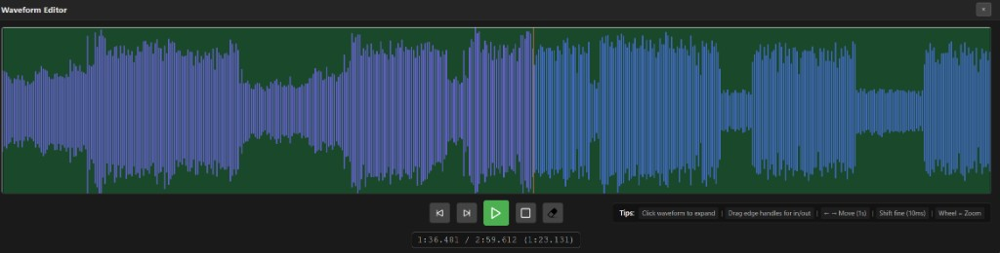
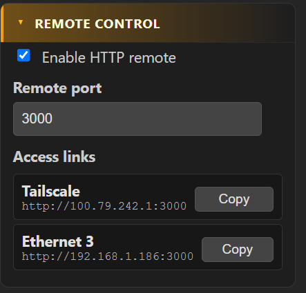

# AV Cueboard

Live audio cue software for **Bitfocus Companion**.

- **Website:** [alani.media](https://alani.media)
- **Releases:** [github.com/alanimedia/avcueboard/releases](https://github.com/alanimedia/avcueboard/releases)
- **User guide:** [HELP.md](HELP.md)

Cross-platform desktop cue engine for live shows: **sections**, **waveform trim**, **live seek/volume**, **crossfade**, **ducking**, dual audio outputs, **per-cue meters**, a **web remote** for tablets/phones, and **missing-media relink**.

## Quick start

Download the latest installer from [Releases](https://github.com/alanimedia/avcueboard/releases) for Windows, macOS, or Linux.

## Screenshots

More UI detail shots (cue defaults, retrigger legend, relink, etc.) live in [`docs/screenshots/`](docs/screenshots/).

## Web remote

AV Cueboard includes a built-in **HTTP remote** so you can trigger and edit cues from another device on the same network (iPad, phone, or second computer) in a normal web browser.

### How to open it

1. In AV Cueboard, open **Settings** (gear on the left).
2. Expand **Remote Control** (see screenshot above).
3. Ensure **Enable HTTP remote** is checked (on by default).
4. Note the **Remote port** (default **3000**).
5. Under **Access links**, copy a URL for this machine (LAN IP or Tailscale), e.g. `http://192.168.1.50:3000`.
6. Open that URL in Safari/Chrome on your tablet or phone (same Wi‑Fi / network as the show PC).

Same-machine testing: `http://127.0.0.1:3000`

### What the remote can do

| Feature | Notes |
|---------|--------|
| Trigger / stop cues | Same grid as the desktop app |
| Playback / Edit mode | Edit names, colors, volume, reorder on a tablet |
| Sections | Collapsible sections match the workspace |
| Master Vol, VU, XFADE, WAVE, Stop | Header strip aligned with the desktop UI |
| Waveform panel | Multi-lane waveforms with seek and live volume |
| Missing media badges | Shows when audio files can’t be found |

> The web remote uses port **3000** (HTTP). Bitfocus Companion uses a separate WebSocket on port **8877**.

## Bitfocus Companion

AV Cueboard talks to Companion over WebSocket (default port **8877**).

When the module is listed on the [Connections](https://bitfocus.io/connections) page, add **Alani Media → AVCueboard**, set the host IP and port, then import presets or assign **Trigger** actions.

Until Bitfocus approves the store listing, install the packaged module manually (below).

### Manual module install — Companion 4.x.x or greater

Requires **Companion 4.x.x or greater**.

1. Download the packaged module:  
   https://github.com/alanimedia/avcueboard-companion-module/raw/main/packages/alanimedia-avcueboard-1.10.0.tgz
2. Launch Companion and open the Admin UI.
3. Go to **Modules → Add Module Package** and select the downloaded `.tgz` file.  
   This adds **Alani Media → AVCueboard** to the list of available modules.
4. Go to **Connections** → add **Alani Media → AVCueboard**.
5. Host: IP of the AV Cueboard PC (`127.0.0.1` if same machine). Port: **8877**.

## Feature highlights

| Area | Capabilities |
|------|----------------|
| **Cue grid** | Sections, drag-reorder, multi-select, square cards, custom colors, loop/retrigger badges |
| **Playback** | Single file & playlist cues, fade in/out, ducking, crossfade mode, Stop All |
| **Waveforms** | In/out trim, expanded editor, bottom panel with stacked lanes, mini strips on buttons, scrub/seek while playing |
| **Meters** | Header master VU + dBFS; per-cue meters; monitor/preview output with LUFS |
| **Outputs** | Main + monitor/preview devices; optional live mirror; cue preview (♪) to monitor |
| **Remote** | HTTP web UI (port 3000) with edit mode, touch reorder, waveforms, XFADE/WAVE |
| **Show safety** | Missing media badges, periodic rescan, relink-by-filename, launch warning |
| **Companion** | WebSocket (8877), variables/feedbacks, layout-ordered presets |

Full UI reference: **[HELP.md](HELP.md)**

## System requirements

Windows 10/11, macOS 10.15+, or Linux · 4 GB RAM (8 GB recommended) · compatible audio output

## Contributing

Issues and pull requests are welcome: [github.com/alanimedia/avcueboard/issues](https://github.com/alanimedia/avcueboard/issues).

## License & credits

AV Cueboard is released under the **MIT License**. See [LICENSE](LICENSE) and [NOTICE](NOTICE).

This project is based on **[acCompaniment](https://github.com/mko1989/acCompaniment)** by **Marcin Wardecki** ([mko1989](https://github.com/mko1989)), also MIT licensed. Original work © Marcin Wardecki. Modifications © Omar Gadahn, [Alani Media](https://alani.media).
